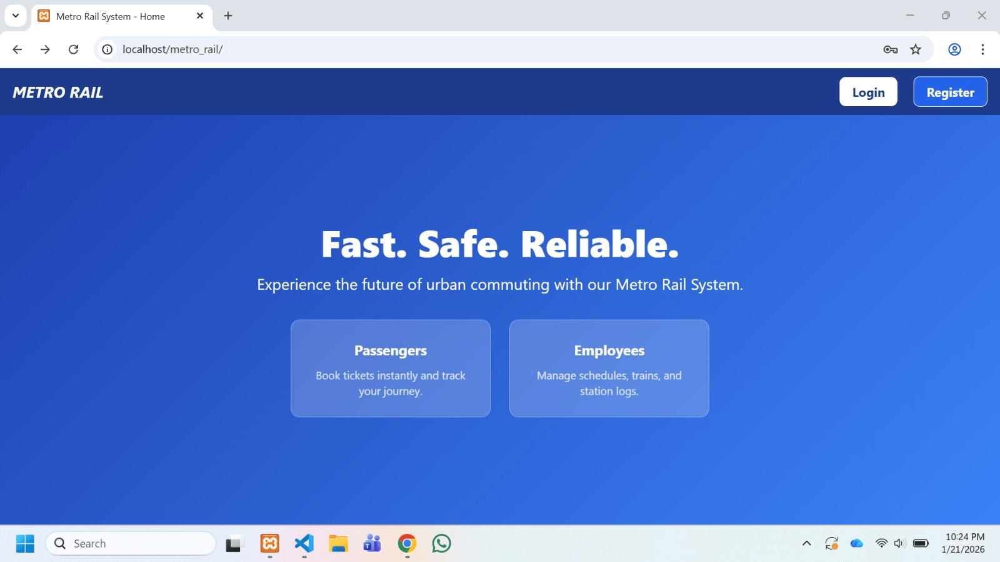

# 🚉 Dhaka Metro Rail Management System

A dynamic and feature-rich Metro Rail Management System built using **PHP**, **Oracle 10g**, and **Tailwind CSS**. This project provides a complete solution for passenger ticket booking and administrative sales reporting.

---

### 🚀 Project Demo

  

---

### ✨ Key Features

- **Dual Authentication:** Separate secure login portals for both **Passengers** and **Employees**.
- **Real-time Fare Calculation:** Automatically fetches the ticket price from the Oracle database based on selected source and destination using **AJAX**.
- **Secure Payment Simulation:** Features a 5-second processing buffer to simulate a realistic payment gateway experience.
- **E-Ticket Generation:** Instantly generates a digital ticket upon successful purchase with an option to **Download as PDF**.
- **Travel History:** Passengers can track all their previous journeys, dates, and fare details in one place.
- **Admin Dashboard:** Employees can monitor total sales, view passenger lists, and generate detailed revenue reports.
- **Robust Database Backup:** Uses Oracle 10g Export utility to ensure data integrity and easy restoration.

---

### 🛠️ Tech Stack

- **Frontend:** HTML5, Tailwind CSS, JavaScript (AJAX)
- **Backend:** PHP (using `oci8` extension for Oracle connectivity)
- **Database:** Oracle 10g Express Edition
- **Reporting:** PDF Generation Library (e.g., FPDF/DomPDF)

### ⚙️ How to Setup

1. **Database Setup:** - Create a user in your Oracle 10g instance.
   - Import the provided `.sql` or `.dmp` backup file to set up the 16 relational tables.
2. **PHP Configuration:** - Open your `php.ini` file and enable the extension by removing the semicolon: `extension=oci8`.
3. **Connection:** - Update your database credentials (Username/Password) in the `config/db.php` file.
4. **Run Project:** - Place the project folder in your XAMPP `htdocs` directory.
   - Access it via `localhost/Dhaka_Metro` in your web browser.

---
### 📸 Project Screenshots

  

---

Developed with ❤️ by **Diamond Halder**
